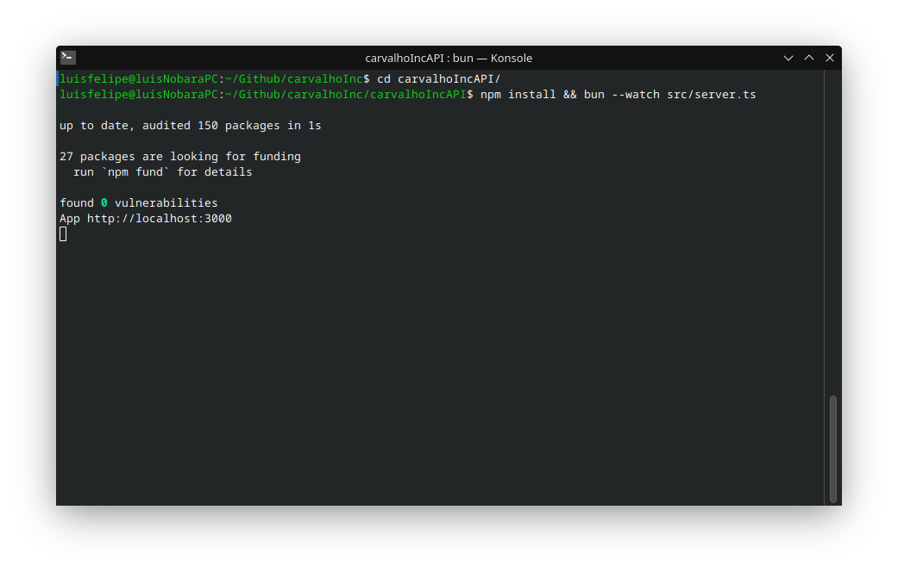

# Amazon search results Scraper

# Usage
You can type any query you want, and press enter, or click the **Scrape** Button.
Doing that will result in a api call that should send this search request to amazon.com and retrieve the page contents filtering out the products  resultant of the query itself, returning only the information we need from the products to the client.

The client has two option when sending the query. Either check *Show data as JSON* or leaving it unchecked. The latter will print the products in the page '*as if*' it was an amazon listing.
While the first option will print a JSON array with the data.

Additionally, there is a helper functionality that shows the user which results are present in the page. A click on the **X** button near the text, should remove the results from that particular search. If the results are bad that will remove it from the screen and you can query again with better words.


For better maintenability and readability the code is modular using best practices.
# Setup

- [x] clone the repository

  Inside of it, you will find a directory for backend, and for frontend

Follow these steps separatelly.

## Frontend

The frontend is using vite as bundler.
You can run
```
npm install && bun run dev
```

To automatically install all of the NPM dependencies for this project which includes vite and axios. And get the development server running. Instructions on how to acess the webpage should be presented on the terminal stdout.


## backend
The backend is a express.js api, using axios and jsdom. With Typescript...

jsdom lets you handle plaintext html using a browser-like api.
Axios is fetching amazon search results pages and feeding it to jsdom, of which we can extract the information we need.

To set everything up.

Simply go to the directory named with an API suffix `carvalhoIncAPI`.

And in a terminal window. Use the following commands.

```
npm install && bun --watch src/server.ts
```

Bun as integrated Typescript support, it can serve typescript files automatically. Should suffice for development.


